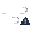
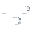

# Meteocons Weather GIFs

A set of [Meteocons](https://bas.dev/work/meteocons) pre-rendered as transparent 32×32 animated GIFs.

The files are named to match Home Assistant’s standardized weather condition values, making them easy to use in dashboards, display integrations, scripts, and other projects that need compact animated weather icons.

## Features

- 32×32 pixels
- Transparent background
- Animated GIF format (/gifs) or static single frames (/static)
- Home Assistant-compatible filenames
- Optimized for small, low-resolution displays
- Includes common daytime, nighttime, precipitation, wind, snow, fog, and storm conditions

  
  
  
  
  
  
  
  
  
  
  
  
  
  
  
  
  
  
  

